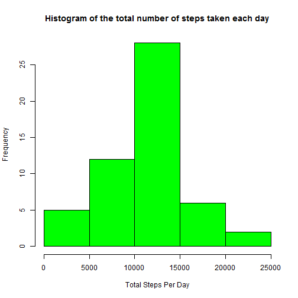
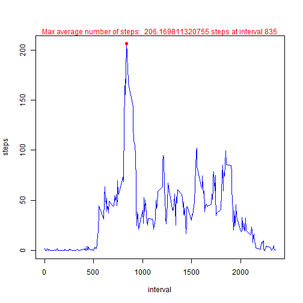
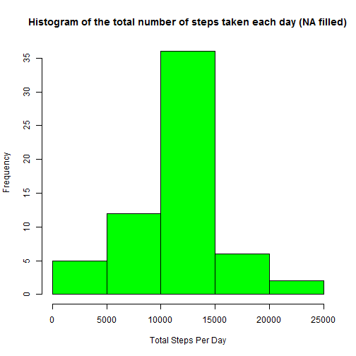

# Reproducible Research: Peer Assessment 1


## Loading and preprocessing the data
The R code below reads the "activity.csv" file, and loads data into a dataframe, namely "activityData".
After that, the columns "date" and "interval"" are merged together to create an integrated dataTime column for the convenience of future processing.

```r
activity<-read.csv("activity.csv", colClasses=c("numeric", "Date", "numeric"))
dateTime<-as.POSIXlt(activity[,2]) + (activity[,3]%/%100)*60*60 + (activity[,3]%%100)*60
data<-cbind(activity, dateTime)
summary(data)
```

```
##      steps            date               interval   
##  Min.   :  0.0   Min.   :2012-10-01   Min.   :   0  
##  1st Qu.:  0.0   1st Qu.:2012-10-16   1st Qu.: 589  
##  Median :  0.0   Median :2012-10-31   Median :1178  
##  Mean   : 37.4   Mean   :2012-10-31   Mean   :1178  
##  3rd Qu.: 12.0   3rd Qu.:2012-11-15   3rd Qu.:1766  
##  Max.   :806.0   Max.   :2012-11-30   Max.   :2355  
##  NA's   :2304                                       
##     dateTime                  
##  Min.   :2012-10-01 00:00:00  
##  1st Qu.:2012-10-16 05:58:45  
##  Median :2012-10-31 11:57:30  
##  Mean   :2012-10-31 11:57:30  
##  3rd Qu.:2012-11-15 17:56:15  
##  Max.   :2012-11-30 23:55:00  
## 
```

```r
head(data,10)
```

```
##    steps       date interval            dateTime
## 1     NA 2012-10-01        0 2012-10-01 00:00:00
## 2     NA 2012-10-01        5 2012-10-01 00:05:00
## 3     NA 2012-10-01       10 2012-10-01 00:10:00
## 4     NA 2012-10-01       15 2012-10-01 00:15:00
## 5     NA 2012-10-01       20 2012-10-01 00:20:00
## 6     NA 2012-10-01       25 2012-10-01 00:25:00
## 7     NA 2012-10-01       30 2012-10-01 00:30:00
## 8     NA 2012-10-01       35 2012-10-01 00:35:00
## 9     NA 2012-10-01       40 2012-10-01 00:40:00
## 10    NA 2012-10-01       45 2012-10-01 00:45:00
```

## What is mean total number of steps taken per day?
The R code below first calculates the total number of steps each day, and stores the result in a dataframe namely "totalStepPerday". After that, calculates the average total number of steps taken per day in the variable namely "meanStepPerDay".


```r
totalStepPerDay<-aggregate(steps~date, data=data, FUN="sum")
hist(totalStepPerDay$steps, col="green", main="Histogram of the total number of steps taken each day",xlab="Total Steps Per Day")
```

 

```r
meanStepPerDay<-mean(totalStepPerDay$steps)
paste("mean of the total number of steps taken each day: ", meanStepPerDay)
```

```
## [1] "mean of the total number of steps taken each day:  10766.1886792453"
```

```r
medianStepPerDay<-median(totalStepPerDay$steps)
paste("median of the total number of steps taken each day: ", medianStepPerDay)
```

```
## [1] "median of the total number of steps taken each day:  10765"
```

## What is the average daily activity pattern?
The R code below plot the average daily activity pattern. The red dot indicates the 5-minute interval with the max average number of steps. The red text on top shows the exact value of max average number of steps, and the exact 5-minute interval. 

```r
meanStepsInterval<-aggregate(steps~interval, data=data, FUN="mean")
plot(meanStepsInterval$interval, meanStepsInterval$steps, type="l", xlab="interval", ylab="steps", col="blue")
maxIndex<-which.max(meanStepsInterval$steps)
xMax<-meanStepsInterval[maxIndex,]$interval
yMax<-meanStepsInterval[maxIndex,]$steps
points(xMax, yMax, pch=19, col="red")
mtext(c(paste("Max average number of steps: ", yMax, "steps at interval", xMax)), col="red")
```

 

## Imputing missing values
The R code below output the number of rows with "NA"s on "steps".

```r
naData<-data[is.na(data$steps),]
naRows<-nrow(naData)
paste("Number of missing values:", naRows)
```

```
## [1] "Number of missing values: 2304"
```

***The strategy of imputing missing values is to replace the "NA"s with the average number of steps of all 5-minute intervals.*** 

The R code below fill the NA data with mean for the 5-minute interval, and store the result in dataframe, namely "dataNAWithMean".

```r
meanPer5Min<-mean(data$steps,na.rm=TRUE)
naData$steps<-meanPer5Min
dataNAWithMean<-rbind(data[complete.cases(data),], naData)
summary(dataNAWithMean)
```

```
##      steps            date               interval   
##  Min.   :  0.0   Min.   :2012-10-01   Min.   :   0  
##  1st Qu.:  0.0   1st Qu.:2012-10-16   1st Qu.: 589  
##  Median :  0.0   Median :2012-10-31   Median :1178  
##  Mean   : 37.4   Mean   :2012-10-31   Mean   :1178  
##  3rd Qu.: 37.4   3rd Qu.:2012-11-15   3rd Qu.:1766  
##  Max.   :806.0   Max.   :2012-11-30   Max.   :2355  
##     dateTime                  
##  Min.   :2012-10-01 00:00:00  
##  1st Qu.:2012-10-16 05:58:45  
##  Median :2012-10-31 11:57:30  
##  Mean   :2012-10-31 11:57:30  
##  3rd Qu.:2012-11-15 17:56:15  
##  Max.   :2012-11-30 23:55:00
```

The R code below repeats the same data analysis of mean total number steps taken perday, against the new dataframe "dataNAWithMean"

```r
totalStepPerDayNA<-aggregate(steps~date, data=dataNAWithMean, FUN="sum")
hist(totalStepPerDayNA$steps, col="green", main="Histogram of the total number of steps taken each day (NA filled)",xlab="Total Steps Per Day")
```

 

```r
meanStepPerDayNA<-mean(totalStepPerDayNA$steps)
paste("mean of the total number of steps taken each day: ", meanStepPerDayNA)
```

```
## [1] "mean of the total number of steps taken each day:  10766.1886792453"
```

```r
medianStepPerDayNA<-median(totalStepPerDayNA$steps)
paste("median of the total number of steps taken each day: ", medianStepPerDayNA)
```

```
## [1] "median of the total number of steps taken each day:  10766.1886792453"
```
The results show that the numbers as well as the histogram are slightly different from the results of previous analysis. However, the impact of imputing missing data on the estimates of the total daily number of steps (i.e. the mean or median value) is minor. Please note that the previous analysis ignore all the "NA"s when performing the calculation (by function "aggregate").
## Are there differences in activity patterns between weekdays and weekends?
The R code below subsets the activity data into two different dataframes. "dataWeekend" contains all the data for weekend days, while "dataWeekday" contains all the data for weekdays.


```r
dataWeekend<-dataNAWithMean[format(dataNAWithMean$date,'%a') == 'Sat' | format(dataNAWithMean$date,'%a') == 'Sun',  ]
dataWeekday<-dataNAWithMean[!(format(dataNAWithMean$date,'%a') == 'Sat' | format(dataNAWithMean$date,'%a') == 'Sun'),  ]
summary(dataWeekend)
```

```
##      steps            date               interval   
##  Min.   :  0.0   Min.   :2012-10-06   Min.   :   0  
##  1st Qu.:  0.0   1st Qu.:2012-10-18   1st Qu.: 589  
##  Median :  0.0   Median :2012-10-31   Median :1178  
##  Mean   : 42.4   Mean   :2012-10-31   Mean   :1178  
##  3rd Qu.: 37.4   3rd Qu.:2012-11-12   3rd Qu.:1766  
##  Max.   :785.0   Max.   :2012-11-25   Max.   :2355  
##     dateTime                  
##  Min.   :2012-10-06 00:00:00  
##  1st Qu.:2012-10-18 17:58:45  
##  Median :2012-10-31 11:57:30  
##  Mean   :2012-10-31 11:57:30  
##  3rd Qu.:2012-11-13 05:56:15  
##  Max.   :2012-11-25 23:55:00
```

```r
summary(dataWeekday)
```

```
##      steps            date               interval   
##  Min.   :  0.0   Min.   :2012-10-01   Min.   :   0  
##  1st Qu.:  0.0   1st Qu.:2012-10-16   1st Qu.: 589  
##  Median :  0.0   Median :2012-10-31   Median :1178  
##  Mean   : 35.6   Mean   :2012-10-31   Mean   :1178  
##  3rd Qu.: 37.4   3rd Qu.:2012-11-15   3rd Qu.:1766  
##  Max.   :806.0   Max.   :2012-11-30   Max.   :2355  
##     dateTime                  
##  Min.   :2012-10-01 00:00:00  
##  1st Qu.:2012-10-16 05:58:45  
##  Median :2012-10-31 11:57:30  
##  Mean   :2012-10-31 11:57:30  
##  3rd Qu.:2012-11-15 17:56:15  
##  Max.   :2012-11-30 23:55:00
```
The R code plots the activity pattern for weekend days and weekdays respectively, using the "lattice" package.


```r
library(lattice)
meanWeekend<-aggregate(steps~interval, data=dataWeekend, FUN="mean")
meanWeekday<-aggregate(steps~interval, data=dataWeekday, FUN="mean")
meanWeekend$weekend<-"weekend"
meanWeekday$weekend<-"weekday"
data2plot<-rbind(meanWeekend, meanWeekday)
xyplot(steps~interval|weekend, data=data2plot, type="l", xlab="Interval", ylab="Number of steps", layout=c(1,2))
```

 

As shown in the graph above, the activity pattern for weekdays and weekend are different. In weekdays, the average number of steps spikes high in the morning, and then remains relatively low for the rest of day. However, for weekend days, there is no spike of the average number of steps at a particular time of the day. However, throughout the day, it may be at a relatively higher level compared with the same time in weekdays.
